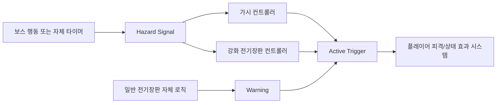

# 지형 시스템 개발 인수인계 문서

## 0. 문서 목적

이 문서는 연구소 아레나의 지형 시스템을 다음 제작자가 이어서 구현할 수 있도록, 현재까지 협의된 내용을 **확정 사항**, **구현 권장안**, **미확정 사항**으로 구분하여 정리한 개발 인수인계 문서다.

다음 제작자는 이 문서를 기준으로 아래 작업을 수행해야 한다.

1. 맵을 구성하는 지형 요소를 코드상으로 구분한다.
2. 플레이어·보스·스킬·위험 지형 사이의 충돌 및 상호작용 규칙을 구현한다.
3. 일반 벽, 벽뚫대시 통과 벽, 맵 경계 벽을 명확히 구분한다.
4. 가시와 전기장판을 독립적인 위험 지형으로 구현한다.
5. 플레이어 및 보스 담당자가 연동할 수 있는 테스트 씬과 인터페이스를 제공한다.
6. 구현 후 실제 적용된 Layer, Tag, Component, Prefab 구조를 문서화해 기획팀과 공유한다.

이 문서에는 대화에서 확인할 수 없었던 피해량, 발동 시간, 애니메이션 길이 등의 수치를 임의로 확정하지 않는다. 해당 값은 기존 노션의 **지형 기획 / 기획 재구성 탭** 또는 기획 담당자 확인을 통해 채워야 한다.


### 0.1 문서 내 상태 표기

| 표기 | 의미 |
|---|---|
| **확정** | 제공된 대화에서 당사자 간 합의 또는 확인이 이루어진 내용 |
| **일부 확정** | 핵심 방향은 확인되었지만 세부 규칙이나 수치가 남아 있는 내용 |
| **권장 구현** | 확정 요구사항을 안전하게 구현하기 위한 기술 제안. 기존 프로젝트 표준이 있으면 그 표준을 우선 |
| **TBD / 미확정** | 기획 또는 담당자 확인 전까지 임의로 고정하면 안 되는 내용 |
| **참조 필요** | 기존 노션의 지형 기획/기획 재구성 탭 또는 관련 시스템 문서에서 값을 가져와야 하는 내용 |

문서의 권장 코드와 오브젝트 구조는 그대로 복사해야 하는 절대 규격이 아니다. 다만 **벽 종류 분리, 경계 우선, 위험 지형의 독립성, 미확정 항목의 설정화**라는 설계 원칙은 유지해야 한다.

---

## 1. 인수인계 배경

초기에는 가시, 전기장판, 벽뚫대시처럼 눈에 띄는 상호작용 요소만 지형 기획 범위로 인식되었다. 그러나 실제 개발을 위해서는 맵을 구성하는 기본 요소인 바닥, 배경, 일반 벽, 통과 가능 벽, 맵 경계, 발판까지 모두 분류해야 한다.

이 분류가 필요한 이유는 다음과 같다.

- 플레이어와 보스가 어디에 설 수 있는지 결정해야 한다.
- 어떤 벽을 일반 이동으로 통과할 수 없는지 결정해야 한다.
- 벽뚫대시가 어느 벽에서만 작동하는지 결정해야 한다.
- 맵 바깥으로 이탈할 수 없는 절대 경계를 정의해야 한다.
- 가시와 전기장판의 대상, 발동 조건, 충돌 판정을 구분해야 한다.
- Tilemap의 시각 레이어와 실제 게임플레이 속성을 분리해야 한다.
- 플레이어 담당자와 보스 담당자가 같은 기준으로 충돌 및 상태를 처리해야 한다.

따라서 이번 작업의 핵심은 단순히 타일을 배치하는 것이 아니라, **각 지형 오브젝트가 어떤 종류이며 누구에게 어떤 방식으로 영향을 주는지를 코드가 판별할 수 있도록 만드는 것**이다.

---

## 2. 대화상 담당 및 협업 맥락

> 아래 내용은 대화에서 드러난 작업 흐름을 정리한 것이다. 실제 직책이나 최종 담당 범위는 프로젝트 내부에서 확인한다.

| 인원 | 대화상 역할 및 맥락 |
|---|---|
| 신유준 | 지형 기획 내용 작성 및 지형별 의도 설명. 기존 노션의 지형 기획/기획 재구성 탭 관리 맥락 |
| 김도연 | GameplayTag, Layer 또는 코드 속성을 통한 지형 특성 구분, 테스트 씬 제작 및 문서화 맥락 |
| 연욱 | 플레이어 측 연동 및 공유 대상 맥락 |

협업 시 다음 순서를 권장한다.

1. 기획 담당자가 지형별 의도와 미확정 항목을 확정한다.
2. 지형 시스템 담당자가 타입, 충돌 규칙, 프리팹 및 테스트 씬을 구현한다.
3. 플레이어 담당자가 벽뚫대시 및 피격 처리와 연동한다.
4. 보스 담당자가 발판, 낙하 공격, 위험 지형 트리거와 연동한다.
5. 최종 Layer/Tag/Component/Prefab 구조를 기획 문서에 역으로 반영한다.

---

## 3. 용어 정리

### 3.1 반드시 구분해야 하는 용어

대화에서 **아레나**라는 단어가 두 가지 의미로 혼용되었다. 코드 및 문서에서는 반드시 분리해서 사용한다.

| 권장 명칭 | 의미 |
|---|---|
| `ArenaRoot` / 전투 공간 | 플레이어와 보스가 전투하는 전체 폐쇄형 맵 |
| `Platform` / 발판 | 캐릭터가 올라설 수 있는 개별 지형. 대화 중 일부에서 “아레나”라고 지칭된 요소 |

`Arena`라는 이름을 발판 타입에 그대로 사용하면 전체 맵과 혼동될 수 있으므로, 구현 명칭은 `Platform`으로 통일하는 것을 권장한다.

### 3.2 주요 용어

| 용어 | 정의 |
|---|---|
| 바닥 `Floor` | 플레이어와 보스의 기본 이동 및 전투가 이루어지는 지형 |
| 배경 `Background` | 시각 표현만 담당하며 충돌과 게임플레이 상호작용이 없는 영역 |
| 일반 벽 `SolidWall` | 플레이어와 보스 모두 통과할 수 없고 벽뚫대시로도 통과하지 못하는 기본 차단 지형 |
| 벽뚫대시 통과 벽 `DashPassableWall` | 플레이어가 벽뚫대시 상태일 때만 통과할 수 있는 특수 벽 |
| 맵 경계 벽 `BoundaryWall` | 맵의 끝을 정의하는 절대 경계. 플레이어와 보스 모두 어떤 정상 수단으로도 통과할 수 없음 |
| 천장 `Ceiling` | 폐쇄형 맵의 상단 경계. 별도 기능이 없다면 `BoundaryWall` 또는 `SolidWall`의 배치 방향으로 처리 |
| 발판 `Platform` | 바닥보다 높은 위치 등에 배치되며 플레이어나 보스가 올라설 수 있는 지형 |
| 가시 `Spike` | 플레이어에게 영향을 주는 위험 지형. 보스 트리거와 연결될 수 있음 |
| 전기장판 `ElectricFloor` | 정해진 자체 로직에 따라 활성화·비활성화되는 독립형 위험 지형 |
| 강화 전기장판 `EnhancedElectricFloor` | 보스의 행동 또는 상태와 트리거가 연결되는 강화형 위험 지형 |
| 일반 대시 | 플레이어 기본 스킬. 지형 타입이 아니며 지형 문서에서는 충돌 결과만 정의 |
| 벽뚫대시 | 특정 특수 벽을 통과할 수 있게 하는 플레이어 스킬 또는 상태 |

---

## 4. 현재 확정된 세계 및 맵 구조

### 4.1 전투 공간

- 맵은 연구소 내부의 **폐쇄형 아레나**다.
- 외부로 통하는 공간은 없다.
- 전체 맵은 바닥, 벽, 천장 또는 배경으로 둘러싸인다.
- 플레이 가능한 범위는 맵 경계 벽으로 제한한다.
- 맵 경계는 벽뚫대시를 포함한 정상 플레이 수단으로 넘어갈 수 없어야 한다.

### 4.2 기본 레이어 구상

대화에서 제안된 Tilemap 구분은 다음과 같다.

- `Background`
- `Floor`
- `Wall`
- `Arena` 또는 `Platform`

대화에서는 “세 개의 레이어”라고 표현했지만 실제로는 네 종류가 나열되었다. 구현 시에는 **최소 네 개의 시각/배치 범주**로 이해하는 것이 자연스럽다.

단, 아래 이유로 시각 레이어만으로 모든 게임플레이 속성을 판별해서는 안 된다.

- `Wall` 안에도 일반 벽, 벽뚫대시 통과 벽, 경계 벽이 존재한다.
- 같은 모양의 타일이라도 맵 위치에 따라 경계 여부가 달라질 수 있다.
- 위험 지형은 보스 트리거 연결 여부와 자체 상태를 가져야 한다.
- 아트 에셋 변경 시 게임플레이 판정이 깨져서는 안 된다.

따라서 **Tilemap Layer는 배치와 렌더링을 위한 큰 분류**, **Component/Tag/Enum은 실제 게임플레이 의미를 위한 세부 분류**로 사용한다.

---

## 5. 구현 범위

### 5.1 이번 작업에 포함

- 지형 타입 정의
- 충돌 Layer 및 Matrix 정의
- 지형별 Component 또는 데이터 구조 정의
- 일반 벽 구현
- 벽뚫대시 통과 벽 구현
- 맵 경계 벽 구현
- 바닥 및 배경 분리
- 발판 기본 구현
- 가시, 전기장판, 강화 전기장판의 공통 위험 지형 구조
- 보스 트리거와 위험 지형의 느슨한 연결 방식
- 플레이어/보스 연동용 API 또는 이벤트
- 통합 테스트 씬
- 테스트 체크리스트
- 구현 결과 문서화

### 5.2 이번 작업에서 임의로 확정하면 안 되는 내용

- 가시의 피해량
- 전기장판의 피해량
- 상태 이상 종류와 지속 시간
- 경고 연출 시간
- 활성화 유지 시간
- 재활성화 대기 시간
- 발판의 플레이어 단방향 통과 여부
- 플레이어가 발판 아래에서 위로 통과하는 정확한 규칙
- 보스가 가시나 전기장판에 피해를 받는지 여부
- 보스 공격이나 투사체가 각 벽을 통과하는지 여부
- 벽뚫대시의 진입 가능 각도, 거리, 종료 위치 보정 규칙
- 특정 벽이 파괴 가능한지 여부

위 항목은 기획 문서 또는 담당자 확인 없이 하드코딩하지 않는다. 구현이 먼저 필요하다면 설정값 또는 기능 플래그로 열어 둔다.

---

## 6. 지형 타입 전체 요약

| 타입 | 역할 | 플레이어 | 보스 | 현재 상태 |
|---|---|---|---|---|
| `Background` | 시각적 배경 | 충돌 없음 | 충돌 없음 | 확정 |
| `Floor` | 기본 이동·전투 공간 | 이동/정지 가능 | 이동/정지 가능 | 확정 |
| `SolidWall` | 일반 차단 벽 | 통과 불가 | 통과 불가 | 확정 |
| `DashPassableWall` | 벽뚫대시 전용 통과 벽 | 평상시 불가, 벽뚫대시 중 가능 | 통과 불가 | 확정 |
| `BoundaryWall` | 맵 절대 경계 | 모든 정상 수단으로 통과 불가 | 통과 불가 | 확정 |
| `Platform` | 높이 차를 만드는 발판 | 상호작용 세부 미확정 | 위에 설 수 있음 | 일부 확정 |
| `Spike` | 위험 지형 | 영향 받음 | 영향 여부 미확정 | 일부 확정 |
| `ElectricFloor` | 독립 동작 위험 지형 | 영향 받음 | 영향 여부 미확정 | 일부 확정 |
| `EnhancedElectricFloor` | 보스 트리거 연동 위험 지형 | 영향 받음 | 영향 여부 미확정 | 일부 확정 |

---

## 7. 지형별 상세 사양

### 7.1 배경 `Background`

#### 목적

- 연구소 내부의 벽면, 하늘처럼 보이는 영역, 장식 오브젝트 등 시각 표현을 담당한다.
- 실제 플레이 영역이 아니다.

#### 확정 동작

- 플레이어가 설 수 없다.
- 보스가 설 수 없다.
- 플레이어와 보스의 이동을 막지 않는다.
- 피격, 피해, 상태 이상, 대시 통과 판정에 참여하지 않는다.

#### 구현 요구사항

- Collider를 두지 않는 것을 기본으로 한다.
- 배경 오브젝트에 Collider가 필요하다면 장식 전용 Collider와 게임플레이 Collider를 명확히 분리한다.
- 플레이어/보스 Physics Layer와 충돌하지 않도록 설정한다.
- 배경의 시각 에셋만 보고 게임플레이 경계를 판단하지 않는다.

#### 완료 조건

- 배경 타일을 추가하거나 변경해도 이동 가능 영역과 충돌 판정이 변하지 않는다.
- 배경에 접촉해도 플레이어나 보스 상태가 변경되지 않는다.

---

### 7.2 바닥 `Floor`

#### 목적

- 플레이어와 보스가 이동하고 전투하는 기본 지형이다.
- 전투 공간의 기준 높이 또는 이동 가능 영역을 형성한다.

#### 확정 동작

- 플레이어가 위에 설 수 있다.
- 보스가 위에 설 수 있다.
- 플레이어와 보스가 자유롭게 이동할 수 있다.
- 바닥 자체는 피해를 주지 않는다.

#### 구현 요구사항

- 플레이어와 보스 모두에 대해 안정적인 지면 판정을 제공한다.
- 경사나 단차가 있다면 기존 이동 시스템의 허용 범위와 맞춘다.
- 바닥 Collider 사이에 틈이 생기지 않도록 Tilemap Collider 또는 Collider 병합 방식을 검토한다.
- 위험 장판을 바닥 위에 겹쳐 배치하는 경우, 바닥 Collider와 위험 지형 Trigger를 분리한다.

#### 주의사항

- `Floor`와 `ElectricFloor`를 동일 타입으로 취급하지 않는다.
- 전기장판은 바닥 모양을 가질 수 있지만, 별도의 위험 지형 Component를 가진 오브젝트여야 한다.

#### 완료 조건

- 플레이어와 보스가 바닥 위에서 튀거나 가라앉지 않는다.
- 타일 경계에서 지면 판정이 끊기지 않는다.
- 위험 장판의 활성화 여부가 바닥 이동 가능 여부를 임의로 변경하지 않는다.

---

### 7.3 일반 벽 `SolidWall`

#### 목적

- 플레이어와 보스의 이동 경로를 차단한다.
- 연구소 내부 구조와 전투 동선을 만든다.

#### 확정 동작

- 플레이어의 일반 이동으로 통과할 수 없다.
- 플레이어의 일반 대시로 통과할 수 없다.
- 플레이어의 벽뚫대시로도 통과할 수 없다.
- 보스가 통과할 수 없다.

#### 구현 요구사항

- Tilemap의 일반 벽 또는 일반 벽 프리팹에 적용한다.
- `DashPassableWall`과 코드상 타입이 달라야 한다.
- 에셋 외형만으로 통과 여부를 판단하지 않는다.
- 플레이어의 벽뚫대시 로직은 벽에 접촉했을 때 `SolidWall`이면 통과를 거부해야 한다.
- 보스 이동/경로 탐색 시스템에서도 차단 지형으로 인식되어야 한다.

#### 미확정

- 플레이어 또는 보스 공격이 벽에 막히는지
- 투사체가 벽에 충돌해 소멸하는지
- 벽이 파괴 가능한지
- 벽 반사 효과가 있는지

이 항목들은 별도의 `ProjectileBlocking`, `Destructible`, `Reflective` 속성으로 분리할 수 있도록 설계한다.

#### 완료 조건

- 플레이어와 보스가 일반 벽을 통과하지 못한다.
- 벽뚫대시를 사용해도 일반 벽 반대편으로 이동하지 않는다.
- 이동 속도가 높거나 프레임이 낮아도 벽을 관통하지 않는다.

---

### 7.4 벽뚫대시 통과 벽 `DashPassableWall`

#### 목적

- 벽뚫대시 사용 시에만 통과 가능한 특수 이동 경로를 제공한다.
- 일반 벽과 구분되는 레벨 디자인 장치다.

#### 시각 구분

대화 기준으로 다음 구성이 의도되어 있다.

- Tilemap에 배치된 벽: 일반 벽
- 번개 표현이 붙은 별도 벽 프리팹: 벽뚫대시 통과 벽

시각 표현은 플레이어에게 규칙을 전달하는 용도로 사용하되, 실제 판정은 Component 또는 Tag로 수행한다.

#### 확정 동작

- 플레이어 일반 이동: 통과 불가
- 플레이어 일반 대시: 통과 불가
- 플레이어 벽뚫대시: 통과 가능
- 보스 이동: 통과 불가

#### 핵심 구현 규칙

1. 플레이어가 벽뚫대시 상태가 아닐 때는 일반 벽처럼 충돌한다.
2. 벽뚫대시 상태일 때만 해당 벽과의 충돌을 일시적으로 무시하거나 전용 통과 로직을 실행한다.
3. 모든 벽 Collider를 무시해서는 안 된다. `DashPassableWall` 타입만 대상으로 한다.
4. 통과 종료 시 플레이어가 벽 내부에 남지 않도록 안전 위치를 계산한다.
5. 벽 뒤쪽에 착지 공간이 없는 경우의 처리 규칙을 별도로 둔다.
6. 맵 경계 벽과 겹치거나 인접한 경우 경계 벽이 우선되어야 한다.
7. 대시 중 상태 해제, 피격, 취소, 씬 일시정지 등이 발생해도 Collider 무시 상태가 복구되어야 한다.

#### 권장 처리 순서

```text
벽뚫대시 시작
→ 진행 방향으로 탐색
→ 최초 접촉 지형 타입 확인
→ DashPassableWall인지 확인
→ 벽 두께 및 출구 공간 확인
→ 통과 가능하면 전용 상태 진입
→ 벽과 플레이어 충돌만 제한적으로 무시
→ 출구 위치까지 이동
→ 충돌 복구
→ 최종 겹침 검사 및 위치 보정
→ 벽뚫대시 종료
```

#### 예외 처리

- 벽 두께가 최대 통과 거리보다 긴 경우: 통과 금지
- 출구가 `BoundaryWall` 바깥인 경우: 통과 금지
- 출구에 다른 `SolidWall`이 겹친 경우: 통과 금지 또는 안전 위치로 보정
- 대시 중 플레이어가 사망한 경우: 모든 무시 충돌 복구
- 씬 리로드 또는 오브젝트 비활성화 시: 모든 무시 충돌 복구

#### 완료 조건

- 평상시에는 일반 벽과 동일하게 플레이어를 막는다.
- 벽뚫대시 중에만 통과된다.
- 보스는 어떤 상태에서도 해당 벽을 통과하지 못한다.
- 통과 후 플레이어가 벽 내부, 맵 외부, 다른 Collider 내부에 남지 않는다.
- 대시 취소나 피격 이후 충돌이 영구적으로 꺼지지 않는다.

---

### 7.5 맵 경계 벽 `BoundaryWall`

#### 목적

- 플레이 가능한 맵 범위를 정의한다.
- 플레이어와 보스가 전투 공간 바깥으로 이탈하지 못하게 한다.
- 폐쇄형 연구소 아레나의 바닥, 좌우 벽, 천장 등 외곽을 구성할 수 있다.

#### 확정 동작

- 플레이어 일반 이동: 통과 불가
- 플레이어 일반 대시: 통과 불가
- 플레이어 벽뚫대시: 통과 불가
- 보스 이동: 통과 불가

#### 우선순위

`BoundaryWall`은 모든 다른 통과 규칙보다 우선한다.

예를 들어 `DashPassableWall`이 경계 벽과 겹치거나 경계 바깥으로 이어지면 벽뚫대시는 실패해야 한다.

#### 구현 요구사항

- 일반 벽과 별도 타입 또는 별도 Layer로 구분한다.
- 카메라 경계와 물리 경계를 동일하다고 가정하지 않는다.
- 맵 외부 낙하 방지, 순간이동, 넉백, 루트 모션, 높은 속도의 이동까지 고려한다.
- 필요하면 물리 경계 외부에 비상 복귀 영역 또는 Kill/Reset Volume을 추가한다.
- 개발용 치트나 디버그 이동을 제외한 모든 정상 플레이 로직에서 통과 불가해야 한다.

#### 완료 조건

- 벽뚫대시, 넉백, 낙하 공격 반동, 순간이동 등으로 맵 밖에 나갈 수 없다.
- 보스의 이동 또는 공격 루트 모션으로 맵 밖에 나가지 않는다.
- 카메라 밖이더라도 물리 경계는 유지된다.
- 맵 경계 Collider의 틈이 없다.

---

### 7.6 천장 `Ceiling`

#### 권장 해석

대화상 천장은 별도의 상호작용 지형이라기보다 폐쇄형 맵을 구성하는 상단 벽이다. 별도 기능이 없다면 아래 중 하나로 처리한다.

- 일반적인 내부 천장: `SolidWall`
- 맵의 최상단 절대 경계: `BoundaryWall`

#### 구현 요구사항

- 천장 방향이라는 이유만으로 별도 코드 타입을 추가할 필요는 없다.
- 카메라에 보이지 않는 상단 이탈 가능 지점도 물리 경계로 막는다.
- 플레이어의 상승 이동, 점프, 대시, 보스의 낙하 공격 준비 동작을 고려한다.

---

### 7.7 발판 `Platform`

#### 목적

- 수직 전투와 높이 차를 만든다.
- 보스가 위에 서거나 낙하 공격에 활용할 수 있는 지형이다.

#### 확정 동작

- 보스가 발판 위에 설 수 있다.
- 보스의 낙하 공격과 같은 행동에 활용될 수 있다.

#### 미확정 동작

플레이어와의 상호작용은 재회의가 필요하다.

- 플레이어가 발판 위에 설 수 있는지
- 아래에서 위로 통과 가능한 단방향 발판인지
- 위에서 아래로 내려갈 수 있는지
- 발판 옆면과 아랫면이 충돌하는지
- 통과 도중 발이 윗면에 닿지 못하면 다시 아래로 떨어지는지
- 벽뚫대시와 발판의 상호작용
- 플레이어가 발판 아래에 있을 때 점프 또는 대시 처리
- 보스와 플레이어가 동시에 발판 위에 있을 때의 충돌 처리

#### 권장 구현

미확정 상태에서 코드를 고정하지 말고 설정 가능한 정책으로 만든다.

```text
Platform.PlayerPolicy
- Solid
- OneWayUp
- PassThrough
- Disabled

Platform.BossPolicy
- Solid
- PassThrough
```

초기 구현은 보스에 대해 `Solid`을 지원하고, 플레이어 정책은 기획 확정 후 Inspector 또는 데이터 값으로 선택할 수 있도록 한다.

#### 완료 조건

현재 확정 범위 기준:

- 보스가 발판 위에 안정적으로 설 수 있다.
- 보스가 발판을 이용한 낙하 공격을 수행해도 Collider를 관통하거나 끼이지 않는다.
- 플레이어 정책은 코드 수정 없이 설정으로 교체할 수 있다.
- 전체 전투 공간을 의미하는 `ArenaRoot`와 발판 `Platform`의 명칭이 혼동되지 않는다.

---

### 7.8 가시 `Spike`

#### 목적

- 플레이어에게 피해 또는 상태 이상을 주는 위험 지형이다.
- 보스의 행동 또는 상태와 트리거가 연결될 수 있다.

#### 확정 동작

- 플레이어에게 영향을 주는 지형이다.
- 보스와 직접 하나의 오브젝트로 결합되는 것이 아니라, 트리거를 통해 연결되는 구조로 이해한다.

#### 미확정

- 접촉 즉시 발동인지
- 일정 주기로 솟아오르는지
- 피해량
- 넉백
- 무적 시간 적용 방식
- 경고 연출 시간
- 활성화 유지 시간
- 보스가 피해를 받는지
- 보스 공격으로 파괴되는지
- 같은 가시에 연속 피격 가능한지

#### 권장 상태 구조

```text
Disabled
→ Telegraph
→ Active
→ Recovery
→ Disabled 또는 Cooldown
```

고정형 접촉 가시라면 `Active` 상태만 사용하는 단순 구조로 축소할 수 있다.

#### 구현 요구사항

- 시각 오브젝트와 피해 Trigger를 분리한다.
- 활성화되지 않은 상태에서 피해 Trigger가 꺼져 있어야 한다.
- 피격 대상 필터를 명시한다.
- 보스 오브젝트를 직접 참조해 동작을 하드코딩하지 않는다.
- 외부 이벤트 또는 Trigger Channel을 통해 활성화할 수 있어야 한다.
- 피해 수치는 데이터로 노출한다.
- 플레이어의 무적 프레임과 중복 피해 정책을 플레이어 피격 시스템과 맞춘다.

#### 완료 조건

- 가시는 보스가 씬에 없어도 독립적으로 로드되고 초기화된다.
- 외부 트리거를 받을 때만 필요한 상태 변경을 수행한다.
- 비활성 상태에서 플레이어에게 피해를 주지 않는다.
- 활성 상태에서 대상 필터에 해당하는 플레이어에게만 효과를 전달한다.
- 씬 재시작 시 정상 초기 상태로 돌아간다.

---

### 7.9 일반 전기장판 `ElectricFloor`

#### 목적

- 정해진 로직에 따라 활성화·비활성화되는 위험 구역이다.
- 보스와 독립적으로 움직이는 환경 요소다.

#### 확정 동작

- 자체적으로 정의된 로직에 따라 작동한다.
- 보스의 존재 여부에 종속되지 않는다.
- 플레이어에게 영향을 준다.

#### 권장 상태 구조

```text
Inactive
→ Warning
→ Active
→ Cooldown
→ Inactive
```

#### 구현 요구사항

- 자체 타이머, 패턴 또는 외부 설정 데이터로 작동할 수 있어야 한다.
- 보스 스크립트를 직접 참조하지 않는다.
- Warning 상태와 Active 상태를 분리한다.
- 실제 피해 Trigger는 Active 상태에서만 켠다.
- 시각 효과, 사운드, 피해 판정의 시작·종료 시점을 한 컨트롤러에서 동기화한다.
- 장판이 여러 개일 경우 시작 오프셋, 주기, 그룹 ID를 설정할 수 있도록 한다.
- 플레이어 피격 시스템에 전달할 Effect ID를 데이터로 관리한다.

#### 필요한 설정값 예시

| 필드 | 설명 |
|---|---|
| `InitialState` | 씬 시작 시 상태 |
| `WarningDuration` | 경고 시간 |
| `ActiveDuration` | 활성화 시간 |
| `CooldownDuration` | 비활성 대기 시간 |
| `StartDelay` | 최초 작동 지연 |
| `Loop` | 반복 여부 |
| `EffectId` | 플레이어에게 전달할 피해/상태 효과 ID |
| `TargetMask` | 영향을 받는 대상 |
| `GroupId` | 동기화할 장판 그룹 |
| `PhaseOffset` | 같은 그룹 내 시작 시간 차이 |

#### 완료 조건

- 보스가 없는 테스트 씬에서도 정상 작동한다.
- 동일한 설정으로 반복 실행했을 때 주기가 일관된다.
- Warning 중에는 피해를 주지 않고 Active 중에만 피해를 준다.
- 비활성화, 씬 종료, 오브젝트 Disable 시 타이머와 Trigger가 안전하게 정리된다.

---

### 7.10 강화 전기장판 `EnhancedElectricFloor`

#### 목적

- 일반 전기장판보다 강화된 위험 요소다.
- 보스의 행동, 페이즈, 공격 또는 별도 트리거와 연결될 수 있다.

#### 확정 동작

- 보스와 직접 결합된 부품이 아니라 독립 오브젝트다.
- 단, 활성화 트리거가 보스와 연결된다.

#### 구현 요구사항

- 일반 전기장판의 공통 상태와 로직을 재사용한다.
- 강화형 전용 파라미터만 확장한다.
- 보스 참조를 Inspector에 직접 물려서 강결합하지 않는다.
- 이벤트 버스, Trigger Channel, ID 기반 신호, 인터페이스 호출 중 프로젝트 표준에 맞는 방식을 사용한다.
- 보스가 파괴되거나 비활성화되어도 장판 오브젝트가 Null Reference를 발생시키지 않아야 한다.
- 보스 페이즈 변경 후 장판이 활성화되더라도 장판 자신의 상태 전이는 장판 컨트롤러가 책임진다.

#### 권장 신호 예시

```text
Boss emits: HazardTrigger("LAB_ELECTRIC_ENHANCED_A", Activate)
EnhancedElectricFloor receives matching channel
→ Warning
→ Active
→ Cooldown
```

#### 미확정

- 일반 전기장판 대비 무엇이 강화되는지
- 피해량 증가인지
- 범위 증가인지
- 활성 시간 증가인지
- 패턴 변화인지
- 다중 장판 연쇄 작동인지

이 내용은 데이터 항목으로 열어 두고 기획 확정 후 채운다.

#### 완료 조건

- 보스 트리거 없이도 오브젝트 생성 및 초기화가 가능하다.
- 올바른 채널 신호에만 반응한다.
- 다른 장판 그룹의 신호에는 반응하지 않는다.
- 보스가 제거되어도 오류 없이 현재 상태를 종료하거나 초기화한다.

---

## 8. 상호작용 매트릭스

### 8.1 이동 및 충돌

범례:

- `O`: 허용
- `X`: 차단
- `TBD`: 기획 확정 필요
- `N/A`: 상호작용 대상 아님

| 지형 | 플레이어 이동 | 일반 대시 | 벽뚫대시 | 보스 이동 | 비고 |
|---|---:|---:|---:|---:|---|
| `Background` | N/A | N/A | N/A | N/A | 플레이 영역이 아닌 시각 요소, Collider 없음 |
| `Floor` | O | O | O | O | 위에서 이동/정지 |
| `SolidWall` | X | X | X | X | 일반 차단 벽 |
| `DashPassableWall` | X | X | O | X | 플레이어 벽뚫대시만 허용 |
| `BoundaryWall` | X | X | X | X | 절대 경계 |
| `Platform` | TBD | TBD | TBD | O | 플레이어 정책 미확정 |
| `Spike` | 이동 가능 여부는 배치 방식에 따름 | TBD | TBD | TBD | 피해 대상과 충돌 형태 분리 필요 |
| `ElectricFloor` | O | O | O | TBD | 이동 가능 바닥 위 Trigger로 권장 |
| `EnhancedElectricFloor` | O | O | O | TBD | 이동 가능 바닥 위 Trigger로 권장 |

### 8.2 피해 및 효과

| 지형 | 플레이어 피해/효과 | 보스 피해/효과 | 작동 주체 |
|---|---|---|---|
| `Floor` | 없음 | 없음 | 없음 |
| `SolidWall` | 없음 | 없음 | 없음 |
| `DashPassableWall` | 없음 | 없음 | 플레이어 스킬과 통과 판정 |
| `BoundaryWall` | 없음 | 없음 | 물리 경계 |
| `Platform` | 없음 | 없음 | 물리 지형 |
| `Spike` | 있음. 상세 수치 참조 필요 | TBD | 외부/보스 트리거 연결 가능 |
| `ElectricFloor` | 있음. 상세 수치 참조 필요 | TBD | 자체 로직 |
| `EnhancedElectricFloor` | 있음. 상세 수치 참조 필요 | TBD | 보스 연계 트리거 + 자체 상태 로직 |

### 8.3 공격 및 투사체

대화에서 공격과 투사체의 지형 반응은 확정되지 않았다. 아래 항목을 별도 매트릭스로 확정해야 한다.

| 항목 | `SolidWall` | `DashPassableWall` | `BoundaryWall` | `Platform` |
|---|---|---|---|---|
| 플레이어 근접 공격 | TBD | TBD | TBD | TBD |
| 플레이어 투사체 | TBD | TBD | TBD | TBD |
| 보스 근접 공격 | TBD | TBD | TBD | TBD |
| 보스 투사체 | TBD | TBD | TBD | TBD |
| 범위 공격 | TBD | TBD | TBD | TBD |
| 낙하 공격 충돌 | TBD | TBD | TBD | 발판 활용 가능 |

공격 차단 여부를 이동 차단 여부와 같은 값으로 자동 추론하지 않는다. 이동은 막지만 공격은 통과하는 벽이 필요할 수 있으므로 별도 속성으로 둔다.

---

## 9. 권장 기술 구조

> 이 절은 대화에서 요구된 기능을 안정적으로 구현하기 위한 권장안이다. 기존 프로젝트 아키텍처가 있다면 해당 표준을 우선한다.

### 9.1 Layer와 게임플레이 타입의 역할 분리

#### Physics Layer가 담당할 것

- 큰 단위 충돌 필터링
- 플레이어
- 보스
- 일반 지형
- 특수 통과 지형
- 경계
- 위험 Trigger
- 공격/투사체

#### Component, Enum 또는 GameplayTag가 담당할 것

- `Floor`
- `SolidWall`
- `DashPassableWall`
- `BoundaryWall`
- `Platform`
- `Spike`
- `ElectricFloor`
- `EnhancedElectricFloor`
- 공격 차단 여부
- 벽뚫대시 통과 여부
- 대상 Actor
- 트리거 채널
- 효과 ID

Unity Physics Layer 수는 제한되어 있으므로 모든 세부 타입마다 별도 Layer를 만드는 방식은 피한다. Layer는 충돌 그룹에 사용하고, 세부 의미는 Component 또는 데이터로 판별한다.

### 9.2 권장 타입 정의

참고용 의사 코드:

```csharp
public enum TerrainKind
{
    Background,
    Floor,
    SolidWall,
    DashPassableWall,
    BoundaryWall,
    Platform,
    Spike,
    ElectricFloor,
    EnhancedElectricFloor
}

[System.Flags]
public enum ActorTarget
{
    None   = 0,
    Player = 1 << 0,
    Boss   = 1 << 1
}

public enum PlayerPlatformPolicy
{
    Disabled,
    Solid,
    OneWayUp,
    PassThrough
}
```

### 9.3 권장 공통 Component

```csharp
public sealed class TerrainDescriptor : MonoBehaviour
{
    public TerrainKind terrainKind;
    public ActorTarget targetMask;

    public bool blocksMovement;
    public bool blocksProjectile;
    public bool allowsWallDashPass;
    public bool isAbsoluteBoundary;
}
```

실제 구현에서는 중복되는 Boolean 조합이 잘못 설정되지 않도록, `TerrainKind`별 기본 프로필을 ScriptableObject 또는 검증 코드로 관리하는 것이 좋다.

예:

- `BoundaryWall`인데 `allowsWallDashPass = true`이면 에디터 오류
- `Background`인데 `blocksMovement = true`이면 경고
- `DashPassableWall`인데 전용 Component가 없으면 경고

### 9.4 위험 지형 공통 인터페이스

```csharp
public interface IHazard
{
    void Activate();
    void Deactivate();
    bool IsActive { get; }
}

public interface IHazardTriggerReceiver
{
    string TriggerChannel { get; }
    void ReceiveHazardSignal(HazardSignal signal);
}
```

위 구조의 목적은 보스 코드가 특정 가시나 장판 클래스에 직접 의존하지 않게 하는 것이다.

### 9.5 위험 지형 이벤트 흐름



핵심 원칙:

- 보스는 “어떤 위험 지형을 언제 작동하라”는 신호만 보낸다.
- 위험 지형 자신의 상태 전이, 시각 효과, 사운드, 피해 Trigger는 위험 지형 컨트롤러가 책임진다.
- 플레이어의 체력 감소와 무적 프레임은 플레이어 피격 시스템이 책임진다.

---

## 10. 권장 씬 및 오브젝트 구조

```text
ArenaRoot
├─ Background
│  └─ BackgroundTilemap
├─ Geometry
│  ├─ FloorTilemap
│  ├─ SolidWallTilemap
│  ├─ BoundaryWallTilemap
│  ├─ PlatformTilemap
│  └─ DashPassableWalls
│     ├─ DashPassableWall_A
│     └─ DashPassableWall_B
├─ Hazards
│  ├─ Spikes
│  │  ├─ Spike_A
│  │  └─ Spike_B
│  ├─ ElectricFloors
│  │  ├─ ElectricFloor_A
│  │  └─ ElectricFloor_B
│  └─ EnhancedElectricFloors
│     └─ EnhancedElectricFloor_A
├─ SpawnPoints
│  ├─ PlayerSpawn
│  └─ BossSpawn
├─ ArenaBounds
│  ├─ CameraBounds
│  └─ EmergencyRecoveryVolume
└─ Debug
   ├─ TerrainDebugOverlay
   └─ HazardTriggerPanel
```

### 구조 설명

- 일반 벽과 경계 벽은 시각적으로 비슷하더라도 Collider 및 타입 관리 편의를 위해 분리하는 것을 권장한다.
- 번개가 표시된 벽뚫대시 통과 벽은 대화상 별도 프리팹이므로 `DashPassableWalls` 아래에 둔다.
- 위험 지형은 `Hazards` 아래에서 종류별로 묶는다.
- `EmergencyRecoveryVolume`은 맵 밖 이탈 버그 발생 시 플레이어/보스를 안전 위치로 복귀시키는 방어 장치다.
- `TerrainDebugOverlay`는 현재 접촉 중인 지형 타입, Layer, Tag, 통과 가능 여부를 화면에 표시하는 개발용 도구다.

---

## 11. 프리팹별 필수 데이터

모든 게임플레이 지형 프리팹은 최소한 아래 정보를 확인할 수 있어야 한다.

| 필드 | 설명 |
|---|---|
| `TerrainId` | 씬 내 또는 데이터상 고유 ID |
| `TerrainKind` | 지형 타입 |
| `PhysicsLayer` | 물리 충돌 그룹 |
| `GameplayTag` | 프로젝트에서 사용하는 의미 태그 |
| `TargetMask` | 영향을 받는 대상 |
| `BlocksPlayer` | 플레이어 이동 차단 여부 |
| `BlocksBoss` | 보스 이동 차단 여부 |
| `AllowsWallDashPass` | 벽뚫대시 통과 여부 |
| `BlocksProjectile` | 투사체 차단 여부 |
| `IsBoundary` | 절대 경계 여부 |
| `EffectId` | 위험 지형이 전달할 효과 |
| `TriggerChannel` | 외부 활성화 신호 채널 |
| `InitialState` | 씬 시작 상태 |
| `DebugLabel` | 테스트 씬 표시용 이름 |

모든 타입에 모든 필드가 필요하지는 않다. 공통 데이터와 타입별 데이터 Component를 나누어 구성해도 된다.

---

## 12. 개발 작업 순서

### 12.1 1단계: 현 프로젝트 구조 확인

- 기존 플레이어 이동 및 대시 상태 구조 확인
- 벽뚫대시 상태를 판별할 수 있는 공식 API 확인
- 플레이어 피격 시스템의 Effect 전달 방식 확인
- 보스 이동 및 낙하 공격 구조 확인
- 기존 Physics Layer와 Collision Matrix 확인
- 기존 GameplayTag 또는 커스텀 태그 시스템 확인
- Tilemap Collider 사용 방식 확인
- 기존 이벤트 버스 또는 신호 시스템 확인

#### 산출물

- 현재 구조 조사 메모
- 재사용 가능한 기존 클래스 목록
- 충돌 Layer 변경 영향 범위

### 12.2 2단계: 지형 타입 및 충돌 기반 구현

- `TerrainKind` 또는 동등한 분류 정의
- 공통 `TerrainDescriptor` 구현
- Physics Layer/Collision Matrix 설정
- Background, Floor, SolidWall, BoundaryWall 기본 구현
- 에디터 검증 또는 런타임 Assertion 추가

#### 산출물

- 타입 정의
- Layer/Tag 표
- 기본 지형 프리팹 또는 Tilemap 설정

### 12.3 3단계: 벽뚫대시 통과 벽 구현

- 전용 프리팹 작성
- 시각 에셋 연결
- 벽뚫대시 상태와 연동
- 통과 전 출구 공간 검사
- 통과 후 안전 위치 보정
- 취소/피격/Disable 시 충돌 복구
- 경계 벽 우선 처리

#### 산출물

- `DashPassableWall` 프리팹
- 벽뚫대시 연동 API
- 단위 테스트 또는 PlayMode 테스트

### 12.4 4단계: 발판 구현

- 보스가 설 수 있는 기본 Collider 구현
- 낙하 공격 테스트
- 플레이어 정책을 설정값으로 분리
- 기획 확정 전 임시 정책을 명시

#### 산출물

- `Platform` 프리팹 또는 Tilemap
- 정책 설정 항목
- 미확정 상태가 코드에 표시된 문서

### 12.5 5단계: 위험 지형 공통 구조 구현

- `IHazard` 또는 동등한 인터페이스
- Warning/Active/Cooldown 상태 구조
- 시각/사운드/피해 Trigger 동기화
- TargetMask
- EffectId 전달
- 씬 재시작 및 Disable 정리

#### 산출물

- 공통 위험 지형 베이스
- 가시 프리팹
- 일반 전기장판 프리팹
- 강화 전기장판 프리팹

### 12.6 6단계: 보스 트리거 연동

- Trigger Channel 또는 ID 정의
- 보스 신호 송신부
- 가시/강화 전기장판 수신부
- 일반 전기장판이 보스 없이 작동하는지 확인
- 보스 제거 시 Null Reference 방지

#### 산출물

- 신호 규약 문서
- 보스 연동 샘플
- 트리거 디버그 UI

### 12.7 7단계: 통합 테스트 씬 제작

- 모든 지형 타입을 한 씬에서 확인
- 플레이어 및 보스 스폰
- 벽뚫대시 반복 테스트 구간
- 경계 이탈 방지 구간
- 발판 낙하 공격 구간
- 위험 지형 자동/수동 발동 구간
- 실시간 타입 표시

#### 산출물

- `TerrainInteractionTestScene`
- 테스트 절차 문서
- 확인 결과

### 12.8 8단계: 문서 및 공유

- 실제 사용한 Layer, Tag, Component 이름 기록
- 프리팹 경로 기록
- 테스트 씬 경로 기록
- 미확정 항목 갱신
- 플레이어/보스 담당자 연동 방식 공유
- 기획팀에 코드상 구현 규칙 전달

---

## 13. 테스트 씬 구성안

테스트 씬은 아래 구역을 한 방향으로 순회할 수 있게 구성하는 것을 권장한다.

```text
[Spawn]
  ↓
[Floor / Background 확인]
  ↓
[SolidWall 일반 이동·일반 대시·벽뚫대시 테스트]
  ↓
[DashPassableWall 벽뚫대시 테스트]
  ↓
[BoundaryWall 이탈 방지 테스트]
  ↓
[Platform 플레이어 정책 / 보스 낙하 공격 테스트]
  ↓
[Spike 수동 트리거 테스트]
  ↓
[ElectricFloor 자동 주기 테스트]
  ↓
[EnhancedElectricFloor 보스 신호 테스트]
  ↓
[Scene Reset / Disable / Reload 테스트]
```

### 디버그 표시 권장 항목

- 현재 플레이어 상태
- 일반 대시 여부
- 벽뚫대시 여부
- 접촉 중인 지형 타입
- 지형 Layer
- 지형 Tag
- 통과 가능 여부
- 현재 위험 지형 상태
- Trigger Channel
- 마지막 수신 신호
- 현재 Effect ID
- 플레이어 무적 상태

---

## 14. 상세 테스트 케이스

### 14.1 배경

- 배경 타일에 플레이어가 충돌하지 않는다.
- 배경 타일에 보스가 충돌하지 않는다.
- 배경을 추가하거나 제거해도 맵 경계가 변하지 않는다.

### 14.2 바닥

- 플레이어가 정지 상태에서 가라앉지 않는다.
- 플레이어가 타일 이음새에서 걸리지 않는다.
- 보스가 이동 중 타일 이음새에서 튀지 않는다.
- 위험 장판이 비활성화되어도 바닥 이동은 가능하다.

### 14.3 일반 벽

- 플레이어 일반 이동 차단
- 플레이어 일반 대시 차단
- 플레이어 벽뚫대시 차단
- 보스 이동 차단
- 높은 속도에서 관통 방지
- 모서리 접근 시 끼임 방지

### 14.4 벽뚫대시 통과 벽

- 일반 이동 차단
- 일반 대시 차단
- 벽뚫대시 통과
- 벽뚫대시 종료 후 충돌 복구
- 연속 벽뚫대시 정상 동작
- 대시 중 피격 시 충돌 복구
- 대시 중 사망 시 충돌 복구
- 대시 중 오브젝트 Disable 시 충돌 복구
- 출구 공간이 없을 때 통과 거부
- 경계 벽 바깥으로 이어질 때 통과 거부
- 보스 통과 차단

### 14.5 경계 벽

- 일반 이동 이탈 방지
- 일반 대시 이탈 방지
- 벽뚫대시 이탈 방지
- 넉백 이탈 방지
- 순간이동 이탈 방지
- 보스 루트 모션 이탈 방지
- 천장 방향 이탈 방지
- 맵 모서리 Collider 틈 확인

### 14.6 발판

- 보스가 위에 설 수 있다.
- 보스 낙하 공격 시작/착지 시 관통하지 않는다.
- 보스와 발판의 이동이 있는 경우 상대 속도를 안정적으로 처리한다.
- 플레이어 정책을 바꾸면 코드 수정 없이 동작이 달라진다.
- 플레이어 정책 미확정 상태가 문서와 Inspector에 표시된다.

### 14.7 가시

- 비활성 상태에서 피해 없음
- Warning 상태가 있다면 피해 없음
- Active 상태에서만 피해
- 동일 프레임 중복 피해 방지
- 무적 시간 연동
- 잘못된 Trigger Channel 무시
- 올바른 Trigger Channel 반응
- 보스가 없어도 초기화 정상
- 씬 리로드 후 상태 초기화

### 14.8 일반 전기장판

- 보스 없이 자동 주기 작동
- Warning과 Active 시각 구분
- Active에서만 피해
- 여러 장판 Group 동기화
- PhaseOffset 적용
- 일시정지 후 타이머 정책 확인
- Disable/Enable 후 중복 Coroutine 또는 Timer 없음

### 14.9 강화 전기장판

- 보스 신호에 반응
- 다른 채널 신호 무시
- 중복 신호 처리 정책 확인
- 활성 중 재활성 신호 처리
- 보스 파괴 후 오류 없음
- 일반 전기장판 공통 로직 재사용 확인

---

## 15. 인수 기준 및 완료 정의

아래 조건이 모두 충족되어야 지형 시스템 1차 개발이 완료된 것으로 본다.

### 기능

- 모든 확정 지형 타입이 코드상 구분된다.
- 일반 벽과 벽뚫대시 통과 벽과 경계 벽이 서로 다른 규칙으로 작동한다.
- 벽뚫대시는 특수 벽만 통과한다.
- 경계 벽은 모든 정상 이동을 차단한다.
- 보스가 발판 위에 설 수 있다.
- 일반 전기장판은 보스 없이 독립적으로 작동한다.
- 가시와 강화 전기장판은 외부 트리거를 받을 수 있다.
- 플레이어에게 전달되는 위험 효과가 플레이어 피격 시스템과 연동된다.

### 안정성

- 씬 재시작 후 상태가 초기화된다.
- 오브젝트 Disable/Destroy 시 충돌 무시와 타이머가 정리된다.
- 보스 또는 플레이어 오브젝트가 없을 때 Null Reference가 발생하지 않는다.
- 높은 이동 속도에서 벽과 경계를 관통하지 않는다.
- Tilemap 경계에 Collider 틈이 없다.

### 협업

- 테스트 씬이 플레이어/보스 담당자에게 공유된다.
- Layer, Tag, Component, Prefab 경로가 문서화된다.
- 미확정 항목이 코드에 하드코딩되지 않는다.
- 기획팀이 실제 구현 규칙을 확인할 수 있다.

---

## 16. 필수 산출물 목록

| 산출물 | 내용 |
|---|---|
| 지형 타입 정의 | Enum, Tag 또는 데이터 테이블 |
| Physics Layer 표 | Layer 이름, 용도, 충돌 대상 |
| Collision Matrix | 플레이어, 보스, 지형, 위험 Trigger, 공격 간 충돌 |
| 지형 Component | 공통 타입 및 세부 속성 |
| 일반 벽 설정 | Tilemap/Prefab 및 Collider |
| 벽뚫대시 통과 벽 프리팹 | 번개 시각 구분, 전용 통과 판정 |
| 경계 벽 설정 | 맵 외곽 절대 경계 |
| 발판 프리팹 | 보스 지지, 플레이어 정책 설정 |
| 가시 프리팹 | 상태, Trigger, Effect 전달 |
| 일반 전기장판 프리팹 | 자체 주기 로직 |
| 강화 전기장판 프리팹 | 보스 Trigger Channel 연동 |
| 통합 테스트 씬 | 모든 지형을 검증할 수 있는 씬 |
| 테스트 결과 | 체크리스트 또는 이슈 목록 |
| 최종 인수인계 문서 | 실제 구현 이름과 경로를 반영한 갱신본 |

---

## 17. 구현 후 반드시 기록할 정보

> 2026-07-22 1차 구현 기준으로 작성. 코드는 `Assets/Scripts/Map/`, 테스트 씬은
> `Tools > Terrain > Build Sample Scene` 메뉴로 생성한다(재실행 시 씬 파일 덮어씀).
> 프리팹 대신 씬 빌더가 오브젝트를 직접 생성하는 방식이며, 아트 적용 단계에서 프리팹화한다.

### 17.1 Layer

| Layer 이름 | 번호 | 용도 | 충돌 대상 |
|---|---:|---|---|
| `Solid` | 3 | 바닥·일반 벽·경계 벽·발판(임시 Solid 정책) | 플레이어 `PlayerMovement.solidLayer` 마스크, 보스 이동 |
| `Player` | 7 | 플레이어 본체 | 위험 지형 겹침 검사(`HazardBase.targetLayers` 기본값) |
| `Boss` | 8 | 보스 본체 | 위험 지형의 보스 피해는 TBD — 확정 시 `targetLayers`에 추가 |
| `Hazard` | 9 | 위험 지형 루트 및 DamageTrigger 자식 | 물리 충돌 없음(겹침 검사 전용) |
| `DashPassableWall` | 11 | 벽뚫대시 통과 벽 전용 | 평상시 플레이어 solidLayer 마스크에 포함. 대시 중 이 비트만 제거하면 통과(문서 7.4) |

- `Ground`(6), `OneWayPlatform`(10)은 기존 Layer로, 지형 시스템 1차 구현에서는 사용하지 않는다.
- `DashPassableWall` Layer는 씬 빌더가 빈 슬롯에 자동 등록한다(다른 PC에서도 메뉴 실행 시 자동 생성).

### 17.2 GameplayTag 또는 타입

Unity Tag는 사용하지 않고 코드 타입(enum + Component)으로 구분한다.

| Tag/Type | 의미 | 사용 위치 |
|---|---|---|
| `TerrainKind` (enum) | 지형 9종 분류. 진실의 원천(TERR-009) | `TerrainDescriptor.terrainKind` |
| `ActorTarget` (Flags enum) | 영향 대상(Player/Boss) | `TerrainDescriptor.targetMask` |
| `PlayerPlatformPolicy` (enum) | 발판-플레이어 정책. **TBD(TERR-006), Inspector로만 교체** | `TerrainDescriptor.playerPlatformPolicy` |
| `HazardBase.HazardState` (enum) | Inactive/Warning/Active/Cooldown | 위험 지형 상태 기계 |

### 17.3 Component

| Component | 책임 | 주요 필드 | 사용 위치 |
|---|---|---|---|
| `TerrainDescriptor` | 지형 의미 부여. 통과 규칙은 kind에서 파생(`AllowsWallDashPass`, `IsAbsoluteBoundary`) | `terrainKind`, `targetMask`, `blocksProjectile`(TBD), `playerPlatformPolicy`(TBD) | 모든 지형 오브젝트 |
| `HazardBase` (abstract) | 위험 지형 공통 상태 기계, 상태별 색상, Active 중 피해 전달 | `warningDuration`·`activeDuration`·`cooldownDuration`(전부 TBD 임시값), `damageObject`, `targetLayers` | 아래 두 클래스의 베이스 |
| `AutoCycleHazard` | 일반 전기장판. 보스 없이 자체 타이머 반복(TERR-007) | `startDelay`, `phaseOffset`, `loop` | `ElectricFloor_A` |
| `ChannelTriggeredHazard` | 가시·강화 전기장판. 채널 신호 수신 시 1회 사이클 | `triggerChannel` | `Spike_A`, `EnhancedElectricFloor_A` |
| `HazardChannel` (static) | 보스↔위험 지형 신호 버스. `Send(channel, activate)` | - | 보스 송신부(예정), `HazardDebugTrigger` |
| `PlayerDamageSource` (기존, 팀 규약) | 피해량 데이터 소스. DamageTrigger 자식에 부착 | `damage`(TBD, 임시 1하트) | 각 위험 지형의 `DamageTrigger` |
| `HazardDebugTrigger` | 테스트용 수동 채널 발사 OnGUI 패널(보스 송신부 대체) | `channels` | 테스트 씬 `Debug/HazardTriggerPanel` |
| `SimpleCameraFollow` | 테스트 씬 전용 추적 카메라 | `target`, `offset` | 테스트 씬 Main Camera |

**피해 전달 방식(중요, 플레이어 담당 공유 필요):** 플레이어 Rigidbody2D가
Kinematic(Full Kinematic Contacts 꺼짐)이라 정적 트리거와 물리 이벤트가 발생하지 않는다.
따라서 `HazardBase`가 Active 상태에서 `Physics2D.OverlapBox` 겹침 검사로
`PlayerHealth.TakeDamage()`를 직접 호출한다. 무적/중복 피격 정책은 `PlayerHealth`가 책임진다.
플레이어 물리 설정이 바뀌면 트리거 이벤트 방식으로 전환할 수 있다.

### 17.4 Prefab 및 Scene 경로

전용 프리팹은 아직 없으며 `TerrainSampleSceneBuilder`가 씬 오브젝트를 직접 생성한다.

| 항목 | 위치 |
|---|---|
| 일반 벽 | 씬 내 `ArenaRoot/Geometry/SolidWall` (Layer `Solid`, kind `SolidWall`) |
| 벽뚫대시 통과 벽 | 씬 내 `ArenaRoot/Geometry/DashPassableWalls/DashPassableWall_A` (Layer `DashPassableWall`) |
| 경계 벽 | 씬 내 `ArenaRoot/Geometry/Boundary_Bottom·Top·Left·Right` (kind `BoundaryWall`) |
| 발판 | 씬 내 `ArenaRoot/Geometry/Platform_Low·High` (kind `Platform`, 임시 Solid 정책) |
| 가시 | 씬 내 `ArenaRoot/Hazards/Spikes/Spike_A` |
| 일반 전기장판 | 씬 내 `ArenaRoot/Hazards/ElectricFloors/ElectricFloor_A` |
| 강화 전기장판 | 씬 내 `ArenaRoot/Hazards/EnhancedElectricFloors/EnhancedElectricFloor_A` |
| 테스트 씬 | `Assets/Scenes/TerrainSampleScene.unity` |
| 씬 생성기 | `Assets/Scripts/Map/Editor/TerrainSampleSceneBuilder.cs` (`Tools > Terrain > Build Sample Scene`) |
| 지형 코드 | `Assets/Scripts/Map/*.cs` |
| 임시 스프라이트 | `Assets/Art/WhiteSquare.png` (빌더가 자동 생성, 16px = 1유닛) |

### 17.5 Trigger Channel

| Channel ID | 송신자 | 수신자 | 동작 |
|---|---|---|---|
| `LAB_SPIKE_A` | `HazardDebugTrigger`(임시) → 보스 송신부(예정) | `Spike_A` | `activate=true`: Warning→Active→Cooldown 1회 / `false`: 즉시 Inactive |
| `LAB_ELECTRIC_ENHANCED_A` | `HazardDebugTrigger`(임시) → 보스 송신부(예정) | `EnhancedElectricFloor_A` | 위와 동일 |

- 보스 측 연동: `HazardChannel.Send("채널ID")` 한 줄이면 된다. 수신 오브젝트 참조 불필요(TERR-008).
- 사이클 진행 중 재신호는 무시된다(중복 신호 정책 TBD — 문서 14.9).

---

## 18. 미확정 사항 및 기획 확인 목록

아래 항목은 개발 중 반드시 추적한다. 확정 전에는 설정 가능 상태로 유지한다.

### 높은 우선순위

1. 플레이어와 발판의 충돌 방식
2. 플레이어가 발판 아래에서 위로 통과 가능한지
3. 플레이어가 발판 위에서 아래로 내려갈 수 있는지
4. 가시가 보스에게 영향을 주는지
5. 일반/강화 전기장판이 보스에게 영향을 주는지
6. 벽과 발판이 플레이어/보스 공격 및 투사체를 차단하는지
7. 벽뚫대시가 통과 가능한 최대 벽 두께
8. 벽뚫대시 출구 공간이 부족할 때 처리 방식

### 중간 우선순위

1. 가시 피해량 및 상태 이상
2. 전기장판 피해량 및 상태 이상
3. 경고, 활성, 쿨다운 시간
4. 강화 전기장판의 “강화” 요소
5. 위험 지형의 반복 피격 간격
6. 플레이어 무적 프레임과 위험 지형의 관계
7. 위험 지형 활성화 중 보스 사망 시 처리
8. 장판 그룹 동기화 여부

### 낮은 우선순위

1. 지형별 사운드
2. 디버그 표시 방식
3. 에디터 검증 UI
4. 경계 외부 비상 복귀 연출
5. 지형별 개발용 색상 오버레이

---

## 19. 주요 위험 요소

### 19.1 에셋 외형만으로 타입을 판별하는 문제

번개 에셋이 붙어 있다는 이유만으로 벽뚫대시 통과 여부를 판별하면, 아트 교체나 프리팹 복제 시 규칙이 깨질 수 있다.

**대응:** `TerrainKind` 또는 전용 Component를 진실의 원천으로 사용한다.

### 19.2 Tilemap Layer와 Physics Layer 혼동

Tilemap의 렌더링/배치 레이어와 물리 충돌 Layer는 목적이 다르다.

**대응:** 문서에서 두 개를 별도 표로 관리하고, 코드가 Tilemap 이름 문자열에 의존하지 않도록 한다.

### 19.3 모든 벽 충돌을 일괄 해제하는 벽뚫대시

벽뚫대시 중 플레이어와 모든 벽의 충돌을 무시하면 경계 이탈과 일반 벽 관통이 발생한다.

**대응:** 현재 접촉 대상이 `DashPassableWall`인지 확인하고 해당 Collider와의 관계만 제한적으로 변경한다.

### 19.4 벽 내부에 플레이어가 남는 문제

대시 종료, 피격, 프레임 드롭, 출구 막힘으로 플레이어가 벽 내부에 남을 수 있다.

**대응:** 통과 전 출구 검사, 종료 시 겹침 검사, 안전 위치 보정, 비상 복귀를 구현한다.

### 19.5 위험 지형과 보스의 강결합

전기장판이 보스 Component를 직접 참조하면 보스가 없는 테스트 씬에서 작동하지 않거나 Null Reference가 발생한다.

**대응:** 이벤트 또는 Trigger Channel로 연결하고 장판 상태는 장판이 관리한다.

### 19.6 발판 규칙의 조기 고정

플레이어 발판 규칙이 확정되지 않은 상태에서 One-way Collider로 고정하면 재작업 가능성이 높다.

**대응:** 정책 Enum 또는 설정값으로 분리한다.

### 19.7 “아레나” 명칭 혼동

전체 전투 공간과 발판을 같은 이름으로 사용하면 클래스, GameObject, 문서 검색에서 혼란이 발생한다.

**대응:** 전체는 `ArenaRoot`, 발판은 `Platform`으로 명명한다.

---

## 20. 권장 검토 회의 안건

구현 전 또는 초기 프로토타입 공유 시 아래 순서로 확인한다.

1. 지형 타입 목록이 충분한가
2. 일반 벽, 통과 벽, 경계 벽의 시각 구분이 플레이어에게 명확한가
3. 발판의 플레이어 상호작용을 어떤 정책으로 할 것인가
4. 보스가 발판을 어떻게 이용하는가
5. 공격과 투사체가 각 벽에 막히는가
6. 가시와 장판이 보스에게도 영향을 주는가
7. 일반 전기장판의 자체 작동 주기는 무엇인가
8. 강화 전기장판의 보스 트리거는 어떤 이벤트인가
9. 위험 지형의 피해 및 상태 효과 ID는 무엇인가
10. 벽뚫대시의 실패 조건과 피드백은 무엇인가

---

## 21. 다음 제작자가 가장 먼저 해야 할 일

1. 프로젝트의 현재 Layer, Tag, Tilemap, Collider 구조를 확인한다.
2. 플레이어 코드에서 일반 대시와 벽뚫대시 상태를 구분하는 공식 방법을 찾는다.
3. `SolidWall`, `DashPassableWall`, `BoundaryWall` 세 종류를 가장 먼저 테스트 씬에 만든다.
4. 경계 벽이 벽뚫대시보다 우선하도록 만든다.
5. 보스가 설 수 있는 `Platform` 프로토타입을 만든다.
6. 일반 전기장판을 보스 없이 작동시키는 공통 위험 지형 구조를 만든다.
7. 가시와 강화 전기장판은 Trigger Channel로 연결한다.
8. 미확정 항목은 Inspector 설정 또는 데이터로 열어 둔다.
9. 플레이어 및 보스 담당자와 테스트 씬을 공유한다.
10. 실제 구현 이름과 경로를 이 문서 17절에 기록한다.

---


## 부록 A. 핵심 의사결정 로그

| ID | 상태 | 의사결정 또는 확인 내용 | 구현 영향 |
|---|---|---|---|
| `TERR-001` | 확정 | 전투 맵은 외부로 통하지 않는 폐쇄형 연구소 아레나다. | 외곽 전체에 절대 경계를 구성해야 한다. |
| `TERR-002` | 확정 | 기본 배치 범주는 Background, Floor, Wall, Platform으로 이해한다. | 대화에서 “세 개”라고 했으나 네 종류가 열거되었으므로 실제 구현 명칭과 개수를 다시 기록한다. |
| `TERR-003` | 확정 | 벽은 최소한 일반 벽, 벽뚫대시 통과 벽, 맵 경계 벽으로 구분해야 한다. | 동일한 `Wall` Layer만으로 처리하지 말고 세부 타입 또는 Component를 둔다. |
| `TERR-004` | 확정 | 번개 표현이 붙은 별도 프리팹이 벽뚫대시 통과 벽을 나타낸다. | 시각 구분과 코드상 `DashPassableWall` 타입을 함께 적용한다. |
| `TERR-005` | 확정 | 보스는 발판을 밟을 수 있고 낙하 공격 등에 활용할 수 있다. | 보스 Ground 판정과 낙하 공격 착지를 발판에서 검증한다. |
| `TERR-006` | 미확정 | 플레이어와 발판의 단방향 통과 및 착지 규칙은 재회의가 필요하다. | 정책을 설정값으로 분리하고 하드코딩하지 않는다. |
| `TERR-007` | 확정 | 일반 전기장판은 보스와 독립적으로 정해진 로직에 따라 작동한다. | 보스 참조 없이 자체 상태와 타이머로 실행 가능해야 한다. |
| `TERR-008` | 확정 | 강화 전기장판과 가시는 보스와 트리거가 연결될 수 있다. | 보스와 직접 강결합하지 말고 이벤트/채널을 통해 연결한다. |
| `TERR-009` | 확정 | GameplayTag, Layer 또는 코드 속성으로 지형 특성을 구분해야 한다. | 에셋 이름이나 외형만으로 게임플레이 타입을 추론하지 않는다. |
| `TERR-010` | 확정 | 일반 대시는 지형 요소가 아니라 플레이어 기본 스킬이다. | 지형 시스템은 일반 대시의 충돌 결과만 제공한다. |

---

## 22. 최종 요약

이 시스템의 핵심 규칙은 다음과 같다.

- 맵은 폐쇄형 연구소 전투 공간이다.
- 배경은 시각 요소이며 게임플레이 충돌이 없다.
- 바닥은 플레이어와 보스의 기본 이동 공간이다.
- 일반 벽은 누구도 통과할 수 없다.
- 벽뚫대시 통과 벽은 플레이어가 벽뚫대시 중일 때만 통과할 수 있다.
- 맵 경계 벽은 어떤 정상 이동 수단으로도 통과할 수 없다.
- 발판은 보스가 밟고 낙하 공격에 활용할 수 있으며, 플레이어 규칙은 미확정이다.
- 일반 전기장판은 보스와 독립적으로 자체 로직에 따라 작동한다.
- 가시와 강화 전기장판은 보스와 직접 결합되지 않고 트리거만 연결된다.
- Tilemap 레이어만으로 지형 특성을 판별하지 말고 코드상 타입을 별도로 부여한다.
- 구현 후 Layer, Tag, Component, Prefab, Trigger 규약을 반드시 문서화해 기획팀과 공유한다.

이 문서에서 `TBD`로 표시된 항목은 구현 누락이 아니라 **기획 확정이 필요한 의도적인 보류 항목**이다. 다음 제작자는 이를 임의로 확정하지 말고 설정 가능한 구조로 구현한 뒤 담당자 확인을 받아 최종값을 반영해야 한다.
